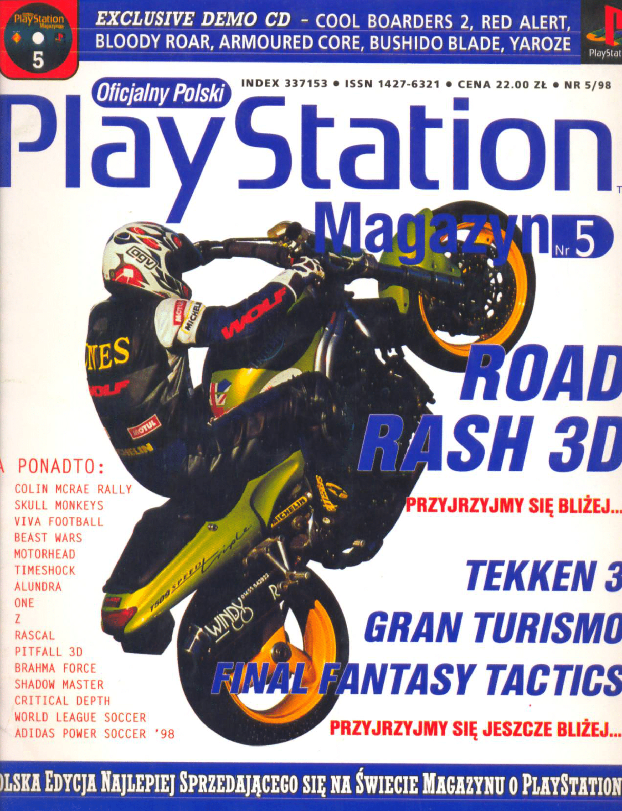
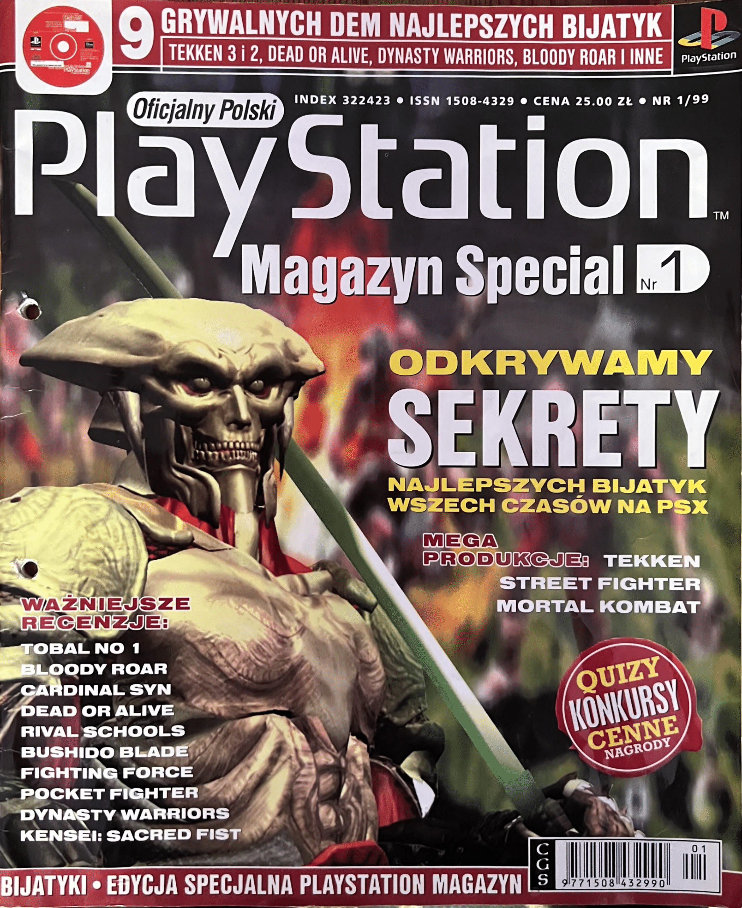

# 

Repozytorium w celu archiwizacji pisma wydawanego w latach 1997-2001 przez Computer Graphics Studio zawierające wiadomości, zapowiedzi, recenzje gier na konsole PlayStation.

## 1997 (3/9)

<table>
  <tr>
    <td align="center">
      <a href="https://github.com/mavethee/Oficjalny-Polski-PlayStation-Magazyn/releases/tag/OPPM-1997-01">
         
        Numer 1
      </a>
    </td>
    <td align="center">
      <a href="https://github.com/mavethee/Oficjalny-Polski-PlayStation-Magazyn/releases/tag/OPPM-1997-03">
         
        Numer 3
      </a>
    </td>
    <td align="center">
      <a href="https://github.com/mavethee/Oficjalny-Polski-PlayStation-Magazyn/releases/tag/OPPM-1997-04">
         
        Numer 4
      </a>
    </td>
  </tr>
</table>

## 1998 (3/13)

<table>
  <tr>
    <td align="center">
      <a href="https://github.com/mavethee/Oficjalny-Polski-PlayStation-Magazyn/releases/tag/OPPM-1998-02">
         
        Numer 2
      </a>
    </td>
    <td align="center">
      <a href="https://github.com/mavethee/Oficjalny-Polski-PlayStation-Magazyn/releases/tag/OPPM-1998-05">
         
        Numer 5
      </a>
    </td>
    <td align="center">
      <a href="https://github.com/mavethee/Oficjalny-Polski-PlayStation-Magazyn/releases/tag/OPPM-1998-06">
         
        Numer 6
      </a>
    </td>
  </tr>
</table>

## 1999 (6/13)

<table>
  <tr>
    <td align="center">
      <a href="https://github.com/mavethee/Oficjalny-Polski-PlayStation-Magazyn/releases/tag/OPPM-1999-04">
         
        Numer 4
      </a>
    </td>
    <td align="center">
      <a href="https://github.com/mavethee/Oficjalny-Polski-PlayStation-Magazyn/releases/tag/OPPM-1999-05">
         
        Numer 5
      </a>
    </td>
    <td align="center">
      <a href="https://github.com/mavethee/Oficjalny-Polski-PlayStation-Magazyn/releases/tag/OPPM-1999-07">
         
        Numer 7
      </a>
    </td>
  </tr>
  <tr>
    <td align="center">
      <a href="https://github.com/mavethee/Oficjalny-Polski-PlayStation-Magazyn/releases/tag/OPPM-1999-08">
         
        Numer 8
      </a>
    </td>
    <td align="center">
      <a href="https://github.com/mavethee/Oficjalny-Polski-PlayStation-Magazyn/releases/tag/OPPM-1999-09">
         
        Numer 9
      </a>
    </td>
    <td align="center">
      <a href="https://github.com/mavethee/Oficjalny-Polski-PlayStation-Magazyn/releases/tag/OPPM-1999-11">
         
        Numer 11
      </a>
    </td>
  </tr>
</table>

## 2000 (2/12)

<table>
  <tr>
    <td align="center">
      <a href="https://github.com/mavethee/Oficjalny-Polski-PlayStation-Magazyn/releases/tag/OPPM-2000-02">
         
        Numer 2
      </a>
    <td align="center">
      <a href="https://github.com/mavethee/Oficjalny-Polski-PlayStation-Magazyn/releases/tag/OPPM-2000-07">
         
        Numer 7
      </a>
    </td>
  </tr>
</table>

## 2001 (2/7)

<table>
  <tr>
    <td align="center">
      <a href="https://github.com/mavethee/Oficjalny-Polski-PlayStation-Magazyn/releases/tag/OPPM-2001-05">
         
        Numer 5
      </a>
    </td>
    <td align="center">
      <a href="https://github.com/mavethee/Oficjalny-Polski-PlayStation-Magazyn/releases/tag/OPPM-2001-07">
         
        Numer 7
      </a>
    </td>
  </tr>
</table>

## Special (1/3)

<table>
  <tr>
    <td align="center">
      <a href="https://github.com/mavethee/Oficjalny-Polski-PlayStation-Magazyn/releases/tag/OPPM-Special-01-1999">
         
        Nr 1/1999
      </a>
    </td>
  </tr>
</table>

## Kompendium PlayStation

Brak posiadanych kompendiów.

## Źródła

* [Blog Gracza](https://gracz.2ap.pl/skany-czasopism/) (1/97, 4/99, 7/01)
* [motorbreath87, archive.org](https://archive.org/details/omplx72000) (7/00)
* [Prywatna kolekcja](https://github.com/mavethee) (6/98, Special 1/99, 07/99, 08/99, 09/99, 11/99, 2/00)
